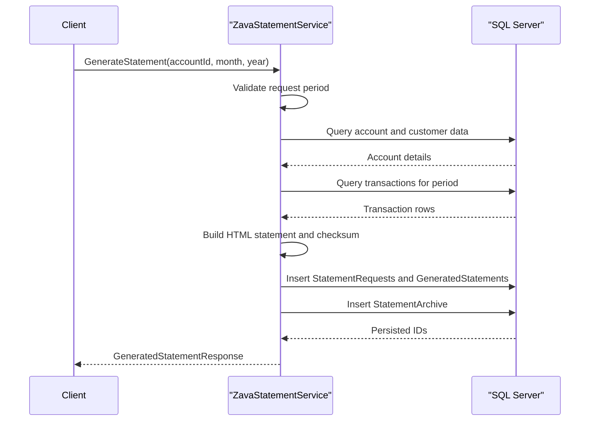

# API & Service Communication Contracts

The service exposes a small SOAP contract with three primary statement operations plus a health endpoint. Communication is synchronous request-response between clients and the service, with direct SQL Server access.

## Service Catalog

| Service | Port | Category | Purpose |
|---|---|---|---|
| `ZavaStatementService` | 8080 (container), IIS/host default otherwise | API Layer | Provides statement generation and retrieval operations via WCF |
| SQL Server (`ZavaBankDB`) | 1433 | Infrastructure | Persists account, transaction, request, archive, and generated statement data |

## API Endpoints Inventory

| Service | Method | Path | Request Type | Response Type |
|---|---|---|---|---|
| `ZavaStatementService` | SOAP Action | `/ZavaStatementService.svc` `GenerateStatement` | Parameters: `accountId`, `month`, `year` | `GeneratedStatementResponse` |
| `ZavaStatementService` | SOAP Action | `/ZavaStatementService.svc` `GetStatementHistory` | Parameters: `accountId` | `StatementHistoryResponse` |
| `ZavaStatementService` | SOAP Action | `/ZavaStatementService.svc` `GetStatement` | Parameters: `statementId` | `StatementDetailResponse` |
| `HealthHandler` | GET | `/health` | None | `text/plain` (`OK`) |

## Management & Observability Endpoints

| Service | Endpoint | Custom Metrics (if any) |
|---|---|---|
| `ZavaStatementService` | `/health` | None detected |
| `ZavaStatementService` | WCF metadata (`?wsdl` via service metadata) | None detected |

## DTOs & Contracts

The API contract uses `GeneratedStatementResponse`, `StatementHistoryResponse`, `StatementHistoryItem`, and `StatementDetailResponse` as response DTO classes, each defined as mutable `DataContract` classes. Request values are primitive operation parameters (`int` IDs and period values) rather than dedicated request DTO classes. Serialization is handled through WCF DataContract serialization semantics.

## Communication Patterns

All service interactions are synchronous over WCF basic HTTP binding. The service performs direct in-process business logic and then uses ADO.NET commands to SQL Server; no asynchronous messaging, service discovery, gateway, circuit breaker, or retry policy configuration was identified. API security posture is minimal: no explicit TLS enforcement, authentication, or authorization checks are configured for service operations in this repository.

## Service Technology Matrix

| Service | Web | Data Access | Discovery | Gateway | Actuator | Cache | Metrics |
|---|---|---|---|---|---|---|---|
| `ZavaStatementService` | WCF (`basicHttpBinding`) | ADO.NET (`SqlConnection`) | None | None | Health handler only | None | None |

## Service Communication Sequence

