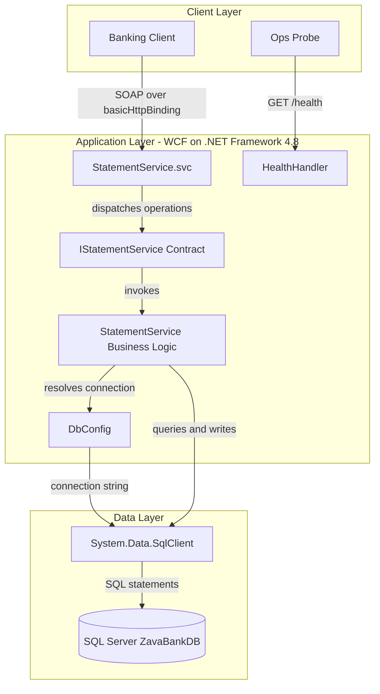
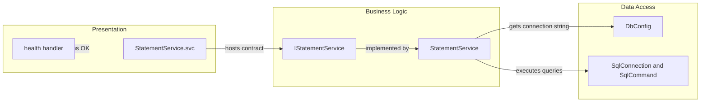

# Architecture Diagram

This repository contains a single .NET Framework 4.8 WCF statement service. The architecture centers on synchronous SOAP operations backed by SQL Server and a simple health endpoint.

## Application Architecture

### Technology Stack Summary

| Layer | Technology | Version | Purpose |
|---|---|---|---|
| Presentation | ASMX/WCF hosting (`.svc`) | .NET Framework 4.8 | Exposes SOAP service operations |
| Business | `StatementService` class | In-repo source | Generates statements and history/detail responses |
| Data Access | `System.Data.SqlClient` | .NET Framework inbox | Executes SQL against banking tables |
| Runtime | Mono (`xsp4` in Docker) | 6.12 | Container runtime for hosting service |

### Data Storage & External Services

The service depends on a SQL Server database (`ZavaBankDB`) accessed with ADO.NET connection strings from environment variables or `web.config`. No additional external API, queue, or cache integrations are declared.

### Key Architectural Decisions

- Uses a single service class implementing all operations through direct SQL commands instead of repositories/ORM.
- Uses `basicHttpBinding` and WCF data contracts for compatibility with SOAP clients.
- Includes a lightweight unauthenticated `/health` endpoint for liveness checks.

## Component Relationships

### Component Inventory

| Component | Layer | Type | Responsibility |
|---|---|---|---|
| `StatementService.svc` | Presentation | WCF host endpoint | Exposes SOAP service entrypoint |
| `IStatementService` | Business | Service contract interface | Defines Generate/Get history/Get detail operations |
| `StatementService` | Business | Service implementation | Executes validation, statement generation, persistence, and retrieval |
| `DbConfig` | Data Access | Configuration helper | Resolves DB connection string from env/config |
| `SqlConnection` + `SqlCommand` usage | Data Access | ADO.NET access | Performs read/write operations to statement and account tables |
| `HealthHandler` | Presentation | HTTP handler | Returns plain-text health status |
