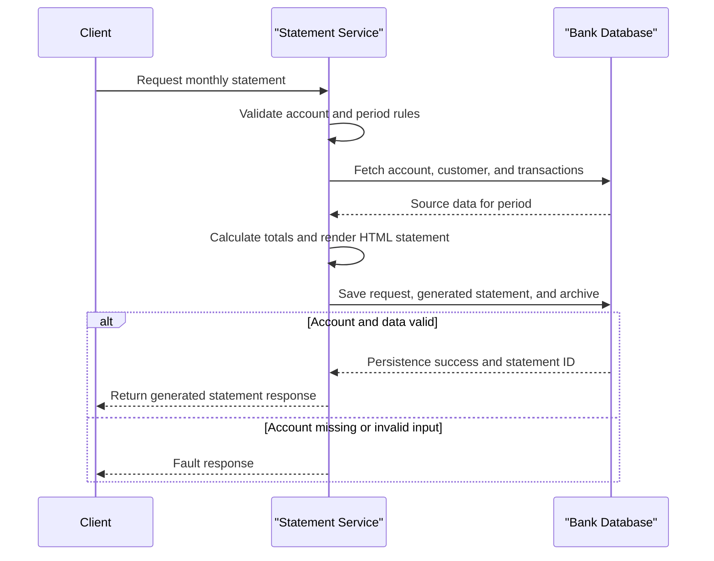

# Core Business Workflows

The application supports monthly bank statement generation and retrieval for customer accounts. Its core workflow validates account-period input, composes statement content from account and transaction data, and archives the generated artifact.

## Domain Entities

| Entity | Service / Bounded Context | Description | Key Relationships |
|---|---|---|---|
| Account | Statement Management | Financial account being reported | Linked to customer, transactions, statement requests |
| Customer | Statement Management | Account owner identity | Referenced when generating statement requests |
| Transaction | Statement Management | Ledger activity used to compute statement totals | Associated with account and transaction type |
| StatementRequest | Statement Management | Request record for generated statement period | Precedes generated statement artifacts |
| GeneratedStatement | Statement Management | Persisted rendered statement document | Tied to request and account |
| StatementArchive | Statement Management | Long-term archive metadata for generated statement | References request/account and checksum |

## Service-to-Domain Mapping

| Service | Domain Context | Owned Entities | External Dependencies |
|---|---|---|---|
| `ZavaStatementService` | Statement Management | StatementRequest, GeneratedStatement, StatementArchive (and read access to Account/Customer/Transaction) | SQL Server (`ZavaBankDB`) |

## Primary Workflows

### Workflow 1: Generate Monthly Statement

1. Client submits `GenerateStatement(accountId, month, year)`.
2. Service validates period and account identifier boundaries.
3. Service loads account/customer information and period transactions.
4. Business logic computes credit/debit totals and builds HTML statement content.
5. Service records request, generated statement, and archive metadata with checksum.
6. Service returns generated statement response including rendered content.

### Workflow 2: Retrieve Statement History

1. Client submits `GetStatementHistory(accountId)`.
2. Service validates account identifier.
3. Service queries recent generated statements for the account.
4. Service returns ordered historical statement metadata.

### Workflow 3: Retrieve Statement Detail

1. Client submits `GetStatement(statementId)`.
2. Service validates statement identifier.
3. Service fetches persisted statement record and HTML payload.
4. Service returns full statement details.

## Cross-Service Data Flows

No multi-service composition was detected. All workflow data is composed within a single service process that reads/writes SQL Server tables directly.

## Business Workflow Sequence

## Business Rules & Decision Logic

- `accountId` and `statementId` must be greater than zero; invalid values return faults.
- `month` must be 1-12 and `year` must be between 2000 and 2100.
- Credits/debits are computed from transaction type and amount sign (`DEP` or positive values count as credits).
- Statement generation persists both generated content and archive checksum metadata to maintain retrievability and integrity tracking.
