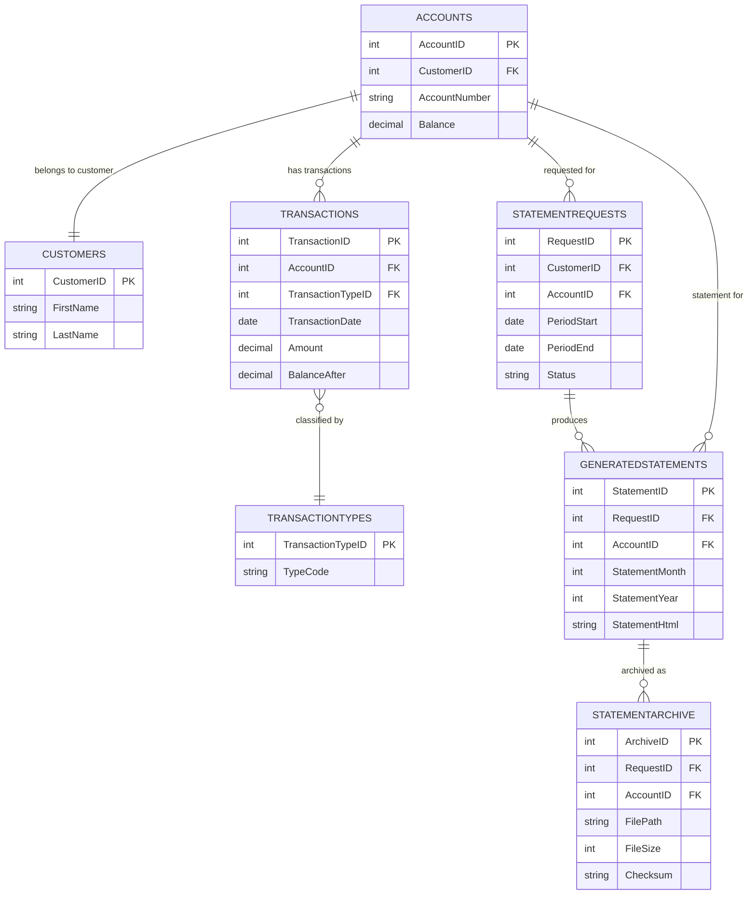

# Data Architecture & Persistence Layer

The persistence layer is SQL Server-centric and implemented through direct ADO.NET commands rather than an ORM. Core data interactions cover account lookup, transaction retrieval, generated statement persistence, and archive tracking.

## Database Configuration

| Service/Module | DB Type | Profile | Driver | Connection | Migration Tool |
|---|---|---|---|---|---|
| `ZavaStatementService` | SQL Server | Default runtime | `System.Data.SqlClient` | Environment variables (`DB_*`/`DATABASE_*`) or `web.config` connection string (`ZavaBankDb`) | None detected |

## Data Ownership per Service

| Service | Tables Owned | ORM Framework | Caching | Notes |
|---|---|---|---|---|
| `ZavaStatementService` | Reads: `Accounts`, `Customers`, `Transactions`, `TransactionTypes`; Writes: `StatementRequests`, `GeneratedStatements`, `StatementArchive` | Raw ADO.NET (no ORM) | None | Creates `GeneratedStatements` table on demand if missing |

## Entity Model

## Key Repository Methods

| Service | Repository | Notable Methods | Purpose |
|---|---|---|---|
| `ZavaStatementService` | `StatementService` (`StatementService.cs`) | `GenerateStatement(int,int,int)` | Reads account+transaction data, computes totals, persists request and generated statement |
| `ZavaStatementService` | `StatementService` (`StatementService.cs`) | `GetStatementHistory(int)` | Returns latest generated statements for an account |
| `ZavaStatementService` | `StatementService` (`StatementService.cs`) | `GetStatement(int)` | Retrieves stored HTML content for a statement ID |
| `ZavaStatementService` | `StatementService` (`StatementService.cs`) | `EnsureGeneratedStatementsTableExists(SqlConnection)` | Creates `GeneratedStatements` table if absent |

## Caching Strategy

No caching provider or cache abstraction is configured. All reads are executed directly against SQL Server, and generated statement HTML is persisted in `GeneratedStatements` for later retrieval.

## Data Ownership Boundaries

This application is a single service with one shared SQL Server database. Data access is direct from the service to database tables with no separate data-service boundary and no CQRS split; the same service handles both read and write paths.

### Data Classification & Sensitivity

| Entity | Sensitive Fields | Classification (PII/PHI/PCI/None) | Controls in Place |
|---|---|---|---|
| `Customers` | `FirstName`, `LastName` | PII | No explicit field-level masking or encryption controls in repository |
| `Accounts` | `AccountNumber` | PII/financial | No explicit field-level masking or encryption controls in repository |
| `StatementArchive` | `FilePath`, `Checksum` | Internal | Integrity checksum stored; no additional confidentiality controls shown |
