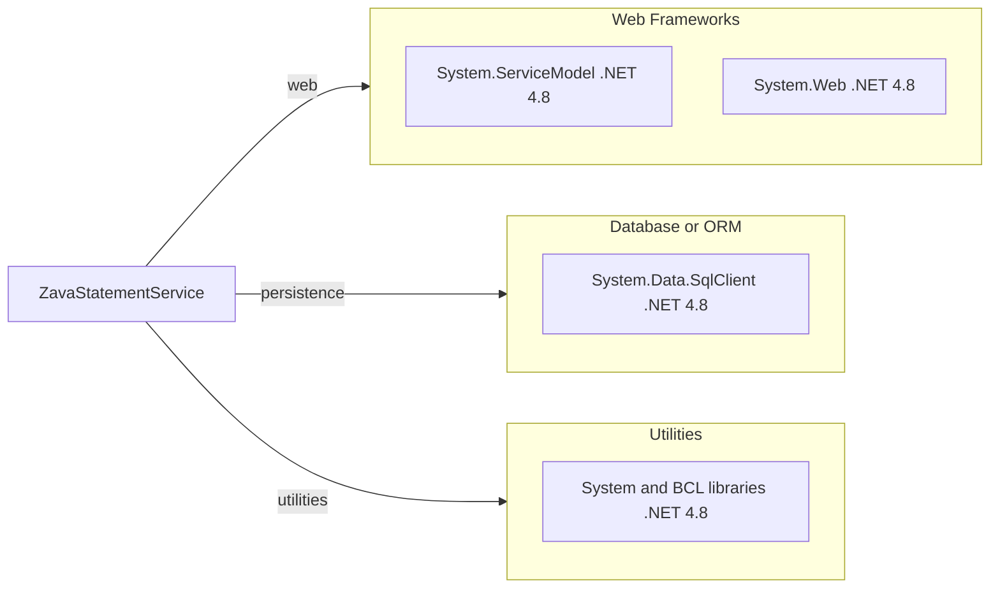

# Dependency Map

This project is a single .NET Framework service with minimal declared external packages and mostly framework-provided dependencies. The declared dependency surface is very small.

## Dependencies

### Dependency Summary

| Category | Count | Key Libraries | Notes |
|---|---:|---|---|
| Web Frameworks | 2 | `System.ServiceModel`, `System.Web` | Legacy WCF SOAP hosting model |
| Database / ORM | 1 | `System.Data.SqlClient` | Direct SQL access without ORM |
| Utilities | 1 | .NET BCL (`System.*`) | Framework libraries only |

### Version & Compatibility Risks

The service targets .NET Framework 4.8, which is Windows-centric and blocks straightforward cross-platform modernization. WCF server hosting in this style does not have direct support on modern .NET, so migration typically requires contract and hosting changes.

### Notable Observations

- `packages.config` is empty; there are no third-party NuGet dependencies declared.
- Dependency surface is mostly framework assemblies referenced directly in the `.csproj`.
- Data access is raw SQL, so migration risk is in SQL compatibility and connection handling rather than ORM behavior.

## Test Dependencies

| Framework | Version | Notes |
|---|---|---|
| None detected | N/A | No test packages declared |

Total test-scope dependencies: 0
No test dependencies detected.
