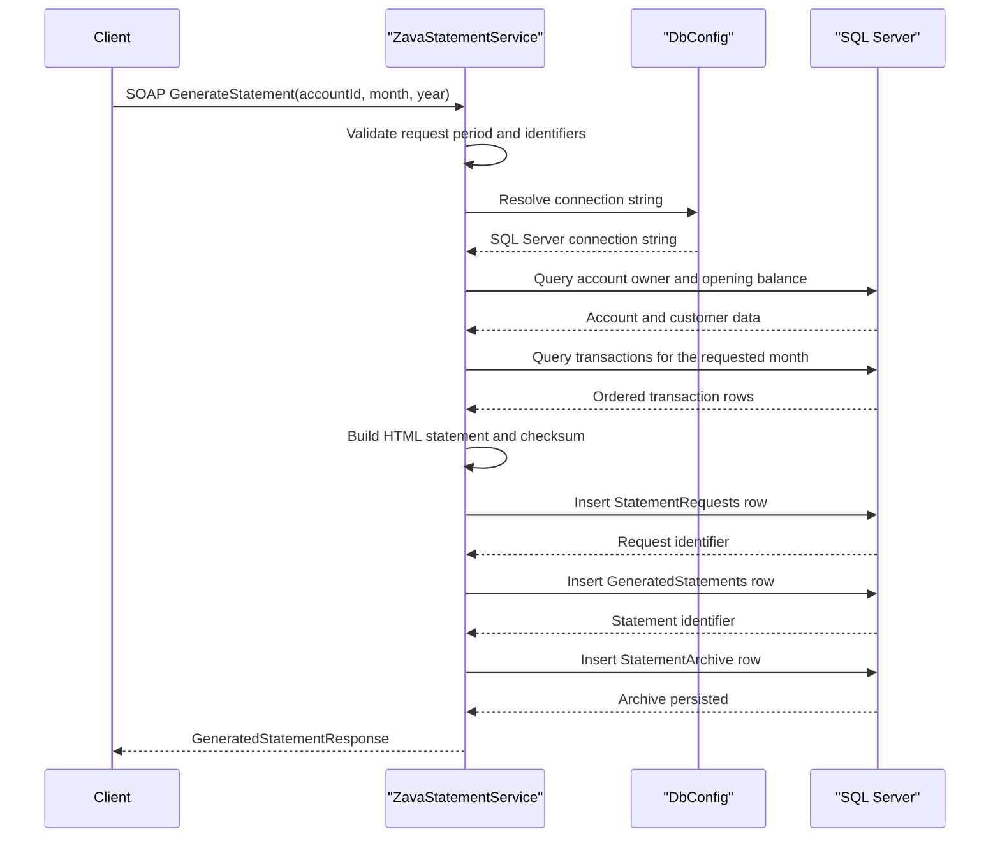

# API & Service Communication Contracts

The application exposes one SOAP service plus a simple HTTP health endpoint. Communication is entirely synchronous and service-to-database; no asynchronous messaging, service discovery, or gateway composition is present.

## Service Catalog

| Service | Port | Category | Purpose |
|---|---|---|---|
| ZavaStatementService | 8080 in Docker, default ASP.NET host otherwise | Business | Generates monthly statement HTML, lists generated statements, and returns stored statement details |
| HealthHandler | 8080 in Docker, default ASP.NET host otherwise | Observability | Returns a plain-text readiness response on `/health` |

## API Endpoints Inventory

| Service | Method | Path | Request Type | Response Type |
|---|---|---|---|---|
| ZavaStatementService | SOAP POST | `/ZavaStatementService.svc` operation `GenerateStatement` | `accountId`, `month`, `year` parameters | `GeneratedStatementResponse` or WCF fault |
| ZavaStatementService | SOAP POST | `/ZavaStatementService.svc` operation `GetStatementHistory` | `accountId` parameter | `StatementHistoryResponse` or WCF fault |
| ZavaStatementService | SOAP POST | `/ZavaStatementService.svc` operation `GetStatement` | `statementId` parameter | `StatementDetailResponse` or WCF fault |
| HealthHandler | GET | `/health` | No request body | Plain-text `OK` |
| ZavaStatementService | GET | `/ZavaStatementService.svc?wsdl` | No request body | WSDL metadata |

## Management & Observability Endpoints

| Service | Endpoint | Custom Metrics (if any) |
|---|---|---|
| HealthHandler | `/health` | None |
| ZavaStatementService | `/ZavaStatementService.svc?wsdl` | None |

## DTOs & Contracts

The service contract is declared by `IStatementService`, which exposes three public operations. `GeneratedStatementResponse`, `StatementHistoryItem`, `StatementHistoryResponse`, and `StatementDetailResponse` are mutable WCF data contracts used as response payloads; request data is passed as primitive operation parameters rather than dedicated request DTO classes. No gateway-level aggregation DTOs, OpenAPI documents, protobuf schemas, or GraphQL schemas are present. Serialization is driven by WCF `DataContract` and `DataMember` attributes.

## Communication Patterns

All communication is synchronous. Clients call the WCF endpoint over `basicHttpBinding`, the service executes direct SQL Server commands through ADO.NET, and the response is returned immediately to the caller. There are no retries, circuit breakers, bulkheads, service discovery components, or message brokers in the repository. API security controls are minimal: `/health` is explicitly open to all users, the WCF endpoint exposes metadata, and no authentication, authorization, or TLS configuration is defined in the repository-level service contract configuration.

## Service Technology Matrix

| Service | Web | Data Access | Discovery | Gateway | Actuator | Cache | Metrics |
|---|---|---|---|---|---|---|---|
| ZavaStatementService | WCF basicHttpBinding on ASP.NET | ADO.NET with inline SQL | None | No | WSDL metadata only | None | None |
| HealthHandler | ASP.NET HTTP handler | None | None | No | Health endpoint | None | None |

## Service Communication Sequence

