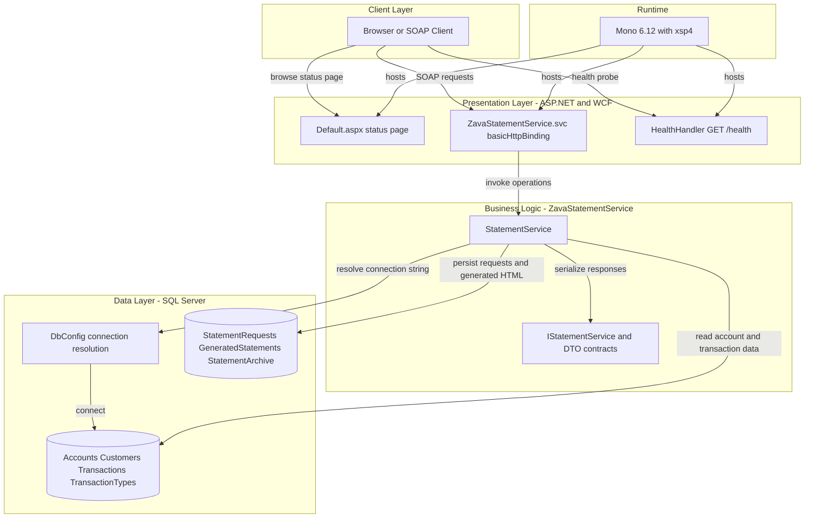
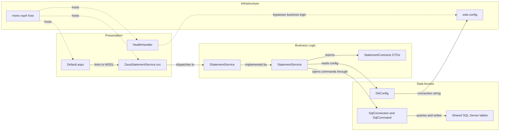

# Architecture Diagram

This repository contains a single ASP.NET/WCF statement-generation service. The application exposes SOAP operations for statement generation and retrieval, serves a lightweight landing page and health probe, and reads and writes statement data in a shared SQL Server database.

## Application Architecture

### Technology Stack Summary

| Layer | Technology | Version | Purpose |
|---|---|---|---|
| Client | Browser or SOAP client | N/A | Calls the WCF service and health endpoint |
| Presentation | ASP.NET Web Forms and WCF basicHttpBinding | .NET Framework 4.8 | Exposes the landing page, SOAP endpoint, and health handler |
| Business | StatementService | Repository code | Validates input, builds HTML statements, and orchestrates database operations |
| Data Access | ADO.NET SqlConnection and SqlCommand | .NET Framework 4.8 | Executes inline SQL against SQL Server |
| Data Storage | SQL Server | Not pinned in repo | Stores account, transaction, request, archive, and generated statement data |
| Runtime | Mono with xsp4 | 6.12 | Hosts the service in the containerized runtime |

### Data Storage & External Services

The only external dependency visible in the repository is SQL Server, configured through either environment variables or the `ZavaBankDb` connection string in `web.config`. The service reads customer, account, and transaction data from shared banking tables and writes statement request, generated statement, and archive records back into the same database.

### Key Architectural Decisions

- Uses a single-service, database-centric design with direct inline SQL instead of repository or ORM abstractions.
- Exposes business operations as SOAP contracts over WCF while keeping health monitoring as a simple HTTP handler.
- Supports both config-file and environment-variable database configuration so the same code can run under IIS-style hosting or containerized Mono hosting.

## Component Relationships

### Component Inventory

| Component | Layer | Type | Responsibility |
|---|---|---|---|
| Default.aspx | Presentation | Web Forms page | Shows service status and links to the WSDL |
| ZavaStatementService.svc | Presentation | WCF service host | Exposes the SOAP endpoint for statement operations |
| HealthHandler | Presentation | HTTP handler | Returns `OK` for readiness and health checks |
| IStatementService | Business Logic | WCF service contract | Declares the three public service operations |
| StatementService | Business Logic | Service class | Validates inputs, queries SQL Server, generates HTML, and stores statement records |
| StatementContracts DTOs | Business Logic | Data contracts | Shapes generated statement, history, and detail responses |
| DbConfig | Data Access | Configuration helper | Resolves DB settings from environment variables or `web.config` |
| SqlConnection and SqlCommand | Data Access | ADO.NET client | Executes inline SQL for read and write operations |
| Shared SQL Server tables | Data Access | Database | Persists core banking data and statement artifacts |
| mono xsp4 host | Infrastructure | Runtime host | Serves the ASP.NET/WCF application in the container image |
