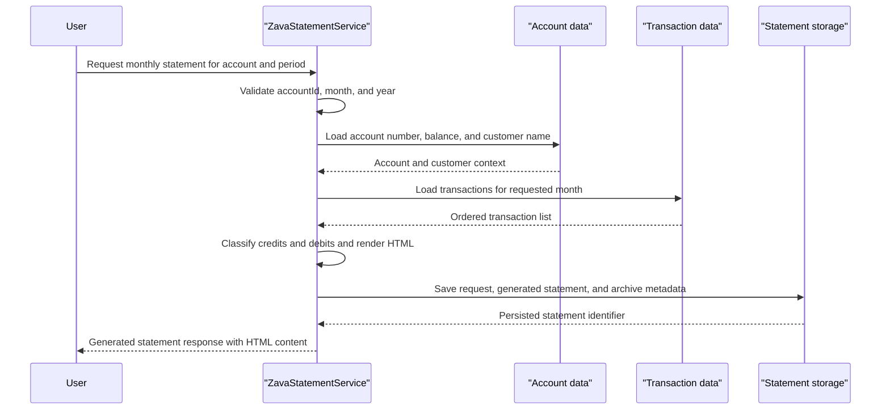

# Core Business Workflows

The application supports a focused banking workflow: generating monthly statements for an account and retrieving previously generated statement artifacts. Its business logic centers on assembling transaction activity into a stored HTML statement that can be viewed later.

## Domain Entities

| Entity | Service / Bounded Context | Description | Key Relationships |
|---|---|---|---|
| Customer | Statement generation | Account holder whose name is displayed on the generated statement | Owns one or more accounts |
| Account | Statement generation | Banking account for which a statement is requested | Belongs to a customer and has many transactions |
| Transaction | Statement generation | Ledger event used to compute credits, debits, and running balances | Belongs to an account and has a transaction type |
| TransactionType | Statement generation | Code that helps classify deposits and debits | Categorizes transactions |
| StatementRequest | Statement generation | Record of a request to generate a statement for a time period | Links the account and customer to generated output |
| GeneratedStatement | Statement generation | Persisted HTML representation of the finished monthly statement | Produced from one request and tied to one account |
| StatementArchive | Statement generation | Archive metadata for long-term retention of a generated statement | Stores file path, size, expiry, and checksum for a request |

## Service-to-Domain Mapping

| Service | Domain Context | Owned Entities | External Dependencies |
|---|---|---|---|
| ZavaStatementService | Statement generation and retrieval | GeneratedStatement, StatementRequest records, StatementArchive records | Shared SQL Server tables for Customer, Account, Transaction, and TransactionType |
| HealthHandler | Service monitoring | None | ASP.NET request pipeline only |

## Primary Workflows

### Workflow 1: Generate monthly statement

A client requests `GenerateStatement` with an account identifier and accounting period. The service validates the inputs, loads the account holder and opening balance, fetches all transactions in the requested month, calculates total credits and debits, renders the statement as HTML, records the request, saves the generated statement, and archives metadata including a checksum and seven-year expiry.

### Workflow 2: View statement history

A client requests `GetStatementHistory` for an account. The service validates `accountId`, ensures the generated-statements table exists, loads up to 100 generated statements for that account ordered by generation time, and returns them as summary items.

### Workflow 3: View statement detail

A client requests `GetStatement` for a stored statement identifier. The service validates `statementId`, ensures the generated-statements table exists, loads the matching HTML statement payload, and returns the persisted detail or a WCF fault if no record exists.

## Cross-Service Data Flows

There is no multi-service choreography in this repository. The only data flow crosses from the WCF service into a shared SQL Server schema: account and customer data are joined directly from banking tables, transaction rows are pulled for the requested period, and statement output is written back to statement-tracking tables. If SQL Server is unavailable, the business workflow cannot continue and no fallback behavior is implemented.

## Business Workflow Sequence

## Business Rules & Decision Logic

- `accountId` must be greater than 0 for all public service operations.
- `month` must be between 1 and 12, and `year` must be between 2000 and 2100, before statement generation begins.
- If the target account or statement record is missing, the service returns a `FaultException` instead of an empty result.
- Transaction totals treat `DEP` transactions or non-negative amounts as credits and all other negative amounts as debits.
- When no transactions exist for the requested period, the generated HTML statement contains a single `No transactions in this period.` row.
- Generated statement archive records are assigned a seven-year expiry and a SHA-256 checksum of the HTML payload.
- The service conditionally creates the `GeneratedStatements` table at runtime if it does not already exist.
