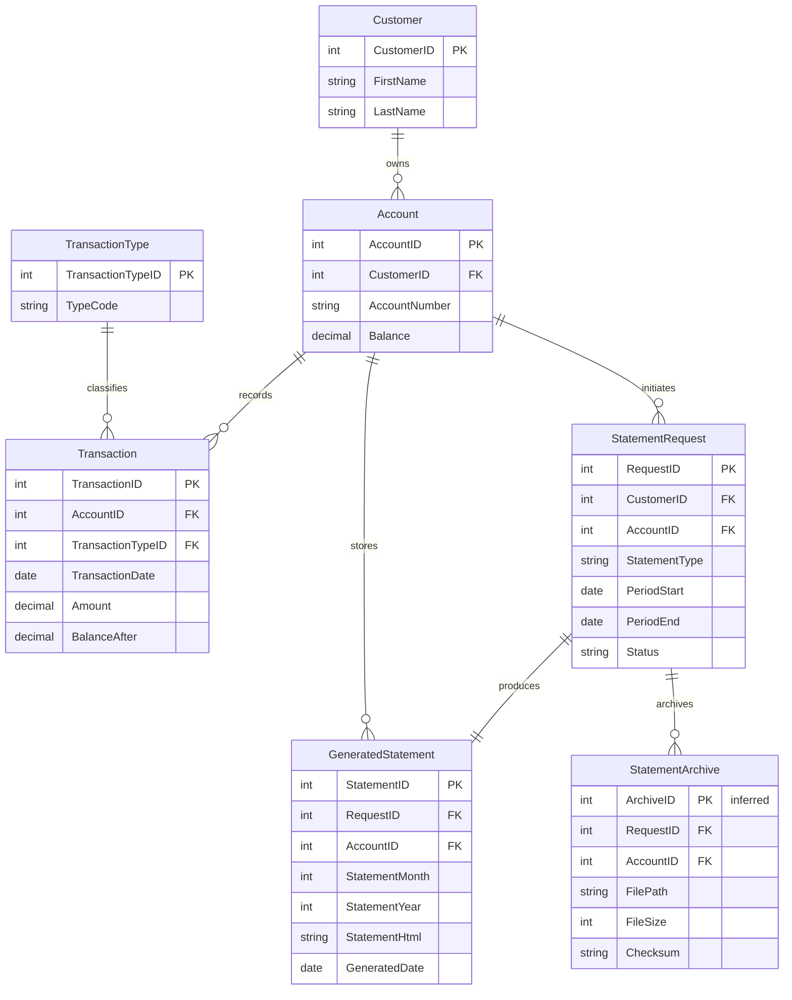

# Data Architecture & Persistence Layer

The service uses a single SQL Server database with raw ADO.NET commands and no ORM layer. Its data model spans shared banking tables that are read by the service plus statement-tracking tables that are created or populated by the application.

## Database Configuration

| Service/Module | DB Type | Profile | Driver | Connection | Migration Tool |
|---|---|---|---|---|---|
| ZavaStatementService | SQL Server | Default config | `System.Data.SqlClient` | `web.config` connection string named `ZavaBankDb` | None detected |
| ZavaStatementService | SQL Server | Container or externalized runtime | `System.Data.SqlClient` | Environment variables `DB_*` or `DATABASE_*` override host, port, database, user, and password | None detected |

## Data Ownership per Service

| Service | Tables Owned | ORM Framework | Caching | Notes |
|---|---|---|---|---|
| ZavaStatementService | `GeneratedStatements` and rows inserted into `StatementRequests` and `StatementArchive` | Raw ADO.NET | None | Reads `Accounts`, `Customers`, `Transactions`, and `TransactionTypes` from a shared database |

## Entity Model

## Key Repository Methods

| Service | Repository | Notable Methods | Purpose |
|---|---|---|---|
| ZavaStatementService | `StatementService.GenerateStatement` | Account lookup query; monthly transaction query; insert into `StatementRequests`; insert into `GeneratedStatements`; insert into `StatementArchive` | Produces an HTML statement and persists request, generated output, and archive metadata |
| ZavaStatementService | `StatementService.GetStatementHistory` | `SELECT TOP 100 ... FROM GeneratedStatements WHERE AccountID = @AccountID ORDER BY GeneratedDate DESC` | Retrieves generated-statement history for one account |
| ZavaStatementService | `StatementService.GetStatement` | `SELECT StatementID, AccountID, StatementMonth, StatementYear, GeneratedDate, StatementHtml FROM GeneratedStatements WHERE StatementID = @StatementID` | Loads one stored generated statement |
| ZavaStatementService | `StatementService.EnsureGeneratedStatementsTableExists` | Conditional `CREATE TABLE dbo.GeneratedStatements` | Bootstraps the generated-statement table if it is missing |

## Caching Strategy

No caching layer is implemented. The service reads directly from SQL Server on each request and writes generated statement artifacts immediately to the database. There are no cache providers, TTL settings, second-level caches, or cache annotations in the repository.

## Data Ownership Boundaries

The application uses a shared-database topology. `ZavaStatementService` depends directly on core banking tables (`Accounts`, `Customers`, `Transactions`, `TransactionTypes`) and writes its own statement-related records back into the same SQL Server instance. All cross-boundary access occurs through direct SQL queries rather than service APIs, events, or CQRS projections.

### Data Classification & Sensitivity

| Entity | Sensitive Fields | Classification (PII/PHI/PCI/None) | Controls in Place |
|---|---|---|---|
| Customer | `FirstName`, `LastName` | PII | No masking or field-level controls visible in repo |
| Account | `AccountNumber`, `Balance` | PII and financial | No encryption or masking configuration visible in repo |
| GeneratedStatement | `StatementHtml` may embed customer name, account number, and transaction details | PII and financial | No encryption-at-rest configuration visible in repo |
| StatementArchive | `FilePath`, `Checksum` | None by itself | No additional controls visible in repo |
