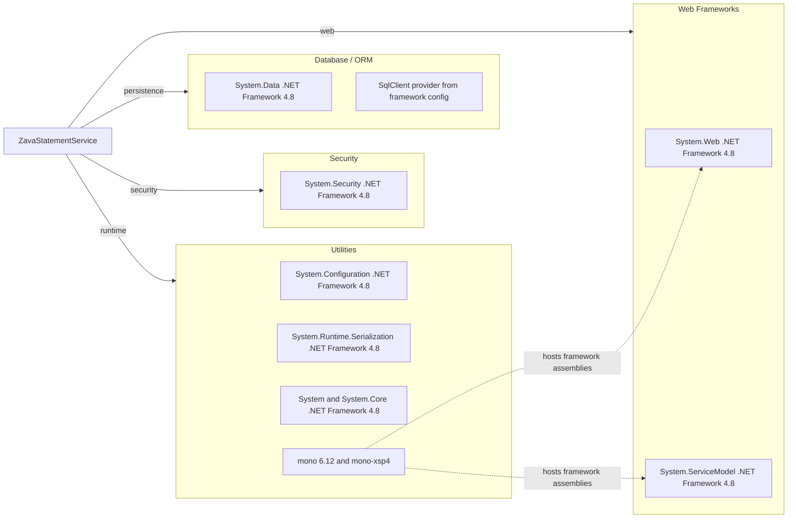

# Dependency Map

This project has a very small declared dependency surface: it relies almost entirely on .NET Framework assemblies plus the Mono runtime used by the Docker image. No NuGet packages are declared in `packages.config`.

## Dependencies

### Dependency Summary

| Category | Count | Key Libraries | Notes |
|---|---|---|---|
| Web Frameworks | 2 | System.Web, System.ServiceModel | Legacy ASP.NET and WCF service stack on .NET Framework 4.8 |
| Database / ORM | 2 | System.Data, SqlClient provider | Uses raw ADO.NET and a SQL Server connection string |
| Security | 1 | System.Security | Used for HTML escaping and checksum support |
| Utilities | 4 | System.Configuration, System.Runtime.Serialization, System, Mono 6.12 | Core runtime and serialization support with Mono container hosting |

### Version & Compatibility Risks

The application targets .NET Framework 4.8 and WCF server hosting, both of which are legacy workloads for Linux container modernization. The Docker image depends on Mono 6.12 and `mono-xsp4`, which helps runtime compatibility today but increases migration effort when moving to modern .NET hosting models.

### Notable Observations

- `packages.config` is empty, so modernization risk comes primarily from framework/runtime dependencies rather than third-party packages.
- `System.ServiceModel` indicates a server-side WCF contract that does not have a direct one-step migration path to modern .NET.
- Database access is performed with inline SQL and framework assemblies only, so no ORM package upgrade path is present.
- The Dockerfile builds with `mcs` and hosts with `xsp4`, reinforcing the dependency on the Mono runtime rather than the .NET SDK runtime.

## Test Dependencies

No test-scoped dependencies detected.

Total test-scope dependencies: 0

No automated test framework is declared in build or package files.
